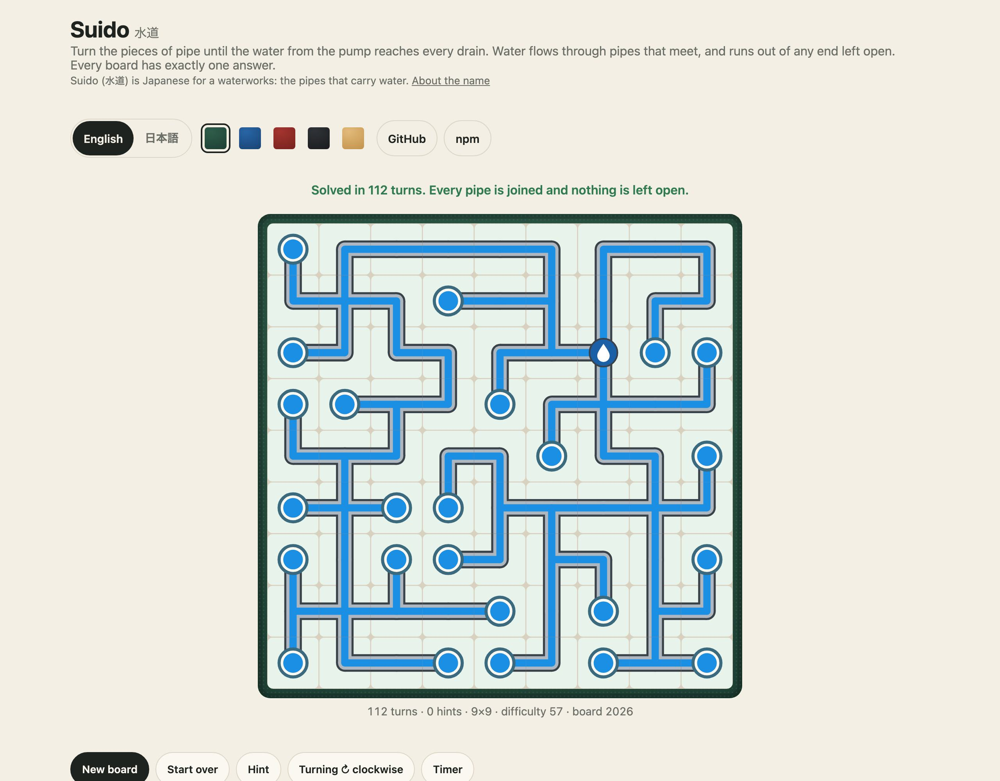
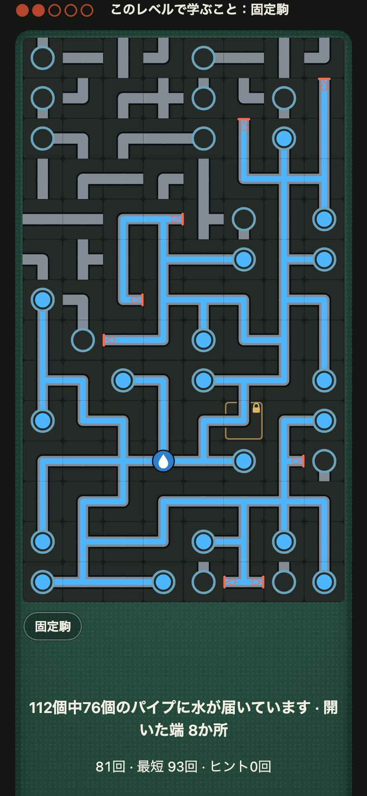

<h1 align="center">Suido <sub>水道</sub></h1>

<p align="center"><strong>A pipe puzzle for JavaScript and TypeScript.</strong><br>
Turn the pieces until the water from the pump reaches every drain and nothing is left open. 3,328 fixed levels from easy to hard, in 5×5 to 14×14 and three long pipe shapes, each with exactly one answer, with walls, locked pieces, wrap-around edges, several pumps, drains and inlet-to-outlet paths. Boards as short codes, a solver that counts answers, a seeded generator whose every board has exactly one, a difficulty from 1 to 100 within each size, and the water drawn as SVG that flows along the pipes as they join, played by tap, mouse and keyboard in any page with one call or one tag. No dependencies.</p>

<p align="center">
  <a href="https://github.com/johnmorrisdotca/suido/actions/workflows/ci.yml"></a>
  <a href="https://www.npmjs.com/package/@johnmorrisdotca/suido"></a>
  <a href="./LICENSE"></a>
  
</p>

<p align="center"><a href="https://johnmorrisdotca.github.io/suido/"><strong>Play the levels →</strong></a> · <a href="https://johnmorrisdotca.github.io/suido/api.html">API reference</a></p>

<p align="center">
  
  
</p>

Suido is the old pipe-rotating puzzle, played with a tap. Every cell holds a
piece of pipe that cannot be moved, only turned. Water comes from a pump,
flows through every opening that meets another, and runs out of any opening
that meets nothing. You win when the water reaches everything it should and
nothing leaks. It is in [the demo](https://johnmorrisdotca.github.io/suido/),
with nothing to install.

## In 30 seconds

```sh
npm install @johnmorrisdotca/suido
```

```ts
import { checkSuidoAnswer, flowOf, makeSuido, newGame, turnAt } from "@johnmorrisdotca/suido";
import { drawSuido } from "@johnmorrisdotca/suido/draw";
import { levelAnswer, loadSuidoLevels } from "@johnmorrisdotca/suido/levels";

const made = makeSuido({ size: 8, difficulty: 70, seed: 7 });   // a board with exactly one answer, about as hard as 70 of 100
made.code;                       // "8x8:…": the board as it is first shown, every piece turned at random
made.difficulty;                 // 1 to 100 among 8×8 boards

let game = newGame(made.code)!;  // a game: how every piece faces now, and how far each has been turned
game = turnAt(game, 12);         // a tap on a cell: a quarter turn clockwise (turnAt(game, 12, -1) the other way)
flowOf(game.start, game.masks);  // where the water has got to, in what order, and where it runs out

checkSuidoAnswer(made.code, made.answer);   // { ok: true }, in O(cells), for a server to trust
const svg = drawSuido(game.start, { masks: game.masks });   // the board as SVG text

const rows = await loadSuidoLevels("8x8");                  // the 256 levels of a size, easiest first, loaded when asked for
checkSuidoAnswer(rows[11][0], levelAnswer(rows[11])!);      // level 12: its board and its one answer
makeSuido({ size: 8, kind: "inlet-outlet", locked: 3, walls: 4, seed: 7 });   // a board of your own, with twists
```

## Who it is for

- **Puzzle sites and apps** that want the puzzle with the rules already right:
  boards that can be made on the fly from a seed and are each guaranteed one
  answer, a check a server can trust, and a drawing whose water flows.
- **Anyone making pipe puzzles of their own**, who wants a solver that counts
  answers, a generator that makes boards with exactly one, and a measure of how
  hard each is.

## Features

- **Fixed, numbered levels.** Thousands of boards in thirteen sizes (5×5 to 14×14 and three long pipe shapes), each with exactly one answer, easy to hard, in blocks of sixteen that open one after another. A level keeps its number, so a time on it can be compared with anybody's. See [Levels](#levels).
- **A level of the day**, the same for everybody, from the date alone: `dailySuidoLevel(size, date)`. No server, no seed.
- **Twists a level declares**: drains, several pumps, locked pieces, walls, wrap-around edges and inlet-to-outlet paths, as options of the generator too.
- **A generator and a solver.** A seeded generator whose every board has exactly one answer, a solver that counts answers, and a difficulty from 1 to 100 within each size.
- **A check a server can trust.** `checkSuidoAnswer` reads a finished board in O(cells), with no search, and says the first thing wrong.
- **Boards and games as short strings**, so a board, its answer and a game half played can be kept in a database column.
- **The water flows.** The board is drawn as SVG text in an entry of its own, and painted in place so the water is seen to run along the pipes as they join and to run back out of one turned away.
- **Played in any page** by tap, mouse and keyboard, with a hint, Start over and the twists as chips, as one function call (`mountSuido`) or one tag (`<suido-board>`).
- **English and Japanese**, in the board's words and the demo.
- **No dependencies**, no network requests, no sound, and nothing stored outside the page it is in.

## Use it in your project

Suido is three things, each usable without the others: **the puzzle** (boards, rules, solver, generator and levels, as plain functions over strings), **the drawing** (SVG text and the painter of the water), and **the page** (a mounted board or a tag). The table under [Playing it in a page](#playing-it-in-a-page) says which entry holds which. The examples play 7×7, level 12.

### 1. The API alone, on a server

```ts
import { checkSuidoAnswer } from "@johnmorrisdotca/suido";
import { dailySuidoLevel, levelAnswer, loadSuidoLevels } from "@johnmorrisdotca/suido/levels";

const rows = await loadSuidoLevels("7x7");
const today = dailySuidoLevel("7x7", new Date());   // the level of the day at 7×7: 1 to 256
const row = rows[today! - 1];                       // send row[0], the board, to the browser; keep the answer
checkSuidoAnswer(row[0], answerFromThePlayer);      // { ok: true } or { ok: false, reason }, in O(cells)
levelAnswer(row);                                   // what the player's answer must come to
```

Importing the main entry on a server is safe: it touches no page.

### 2. One tag, no bundler

```html
<script type="module" src="https://cdn.jsdelivr.net/npm/@johnmorrisdotca/suido@1/dist/element-define.js"></script>
<suido-board size="7x7" level="12" chips hints></suido-board>
<script>
  document.querySelector("suido-board").addEventListener("suido-solve", (event) => console.log(event.detail.code));
</script>
```

### 3. A bundler, and a framework

`import "@johnmorrisdotca/suido/element/define"` once, in code that runs in the browser, and `<suido-board>` is a tag like any other. The tag draws itself in the page's own DOM, so the page's CSS reaches it. Its attributes are read again when they change, and it speaks through DOM events (`suido-change`, `suido-turn`, `suido-hint`, `suido-turning`, `suido-solve`) that carry a `detail`.

```jsx
// React 19
import { useEffect, useRef } from "react";
import "@johnmorrisdotca/suido/element/define";

export function Level({ size, level, onSolved }) {
  const board = useRef(null);
  useEffect(() => {
    const listen = (event) => onSolved(event.detail.code, event.detail.turns);
    board.current?.addEventListener("suido-solve", listen);
    return () => board.current?.removeEventListener("suido-solve", listen);
  }, [onSolved]);
  return <suido-board ref={board} size={size} level={String(level)} hints />;
}
```

```vue
<!-- Vue 3: tell the compiler the tag is not a Vue component -->
<script setup>
import "@johnmorrisdotca/suido/element/define";
defineProps({ size: String, level: Number });
</script>
<template>
  <suido-board :size="size" :level="level" hints @suido-solve="(event) => console.log(event.detail.code)" />
</template>
<!-- in vite.config: vue({ template: { compilerOptions: { isCustomElement: (tag) => tag.startsWith("suido-") } } }) -->
```

```svelte
<!-- Svelte 5 -->
<script>
  import "@johnmorrisdotca/suido/element/define";
  let { size, level } = $props();
  let board;
  $effect(() => {
    const listen = (event) => console.log(event.detail.code);
    board.addEventListener("suido-solve", listen);
    return () => board.removeEventListener("suido-solve", listen);
  });
</script>
<suido-board bind:this={board} size={size} level={level} hints></suido-board>
```

```ts
// Angular: a standalone component with CUSTOM_ELEMENTS_SCHEMA
import { Component, CUSTOM_ELEMENTS_SCHEMA } from "@angular/core";
import "@johnmorrisdotca/suido/element/define";

@Component({
  selector: "app-level",
  standalone: true,
  schemas: [CUSTOM_ELEMENTS_SCHEMA],
  template: `<suido-board size="7x7" level="12" hints (suido-solve)="solved($event)"></suido-board>`,
})
export class Level {
  solved(event: Event) { console.log((event as CustomEvent).detail.code); }
}
```

In Next.js or any server-rendering framework, import the define entry from a client component, so the tag is defined in the browser. Or skip the tag and call `mountSuido(element, options)` from `@johnmorrisdotca/suido/play` in an effect: the handle it returns has `destroy()`.

`pnpm test:frameworks` builds these recipes from the packed tarball in a scratch project for each of the five and solves a level in each, in Chromium and WebKit; it needs the network and a few minutes, so it is run before a release and in CI rather than with `pnpm check`.

### What a developer gets

- **Typed results**, with a doc comment on every export. Every function is pure and returns new values.
- **No dependencies.** ES modules, an entry per concern, and `sideEffects` set so that only the define entry has an effect.
- **Where it runs.** See [Browser support](#browser-support).

## The puzzle

A board is a grid of cells. Each holds a piece, which opens on some of its four
sides: an **end** (one side), a **straight** (two opposite), an **elbow** (two
that meet), a **T** (three) or a **cross** (four), or is bare ground. A tap turns
a piece a quarter, clockwise or the other way; a piece is never moved or
changed. Water comes in at the **pumps**. It goes from a piece into the next
wherever the two openings meet, and **runs out** of any opening of a wet piece
that meets nothing: the edge of the board, bare ground, or a piece that does not
open back. The board is solved when the water reaches what its kind asks and
nothing runs out.

- **Network** (the default): every piece must be wet, and nothing may run out.
  Every cell holds a piece.
- **Drains**: every drain must be reached, and nothing wet may run out. Pieces the
  water does not reach are *spares*: they may be left dry and face any way, so a
  spare is a thing to see past. A drains board has bare ground too.

Either way a board has **exactly one answer**: the generator makes only boards the
solver proves have one (for a drains board, one network of wet pieces; a spare
facing another way is not another answer).

Options, any of which may be combined (each is a *twist*, and a level declares the ones it has: see [Levels](#levels)):

- **Drains**: the kind above, where only the drains must be reached.
- **Several pumps**: each feeds its own pipes, which may meet.
- **Locked pieces**: some pieces cannot be turned. They are given facing the way the answer has them, and a padlock marks each.
- **Walls**: water cannot cross some of the edges between cells, so a pipe open towards one runs out of it.
- **Wrap**: the edges join, so a pipe leaving one side comes in at the other.
- **Inlet to outlet**: the third kind. One pump at the top left and one drain at the bottom right, and the water must run between them in one path with no branch (every wet piece opens on two sides); the other pieces are decoys and stay dry.
- **Any shape**: boards from 2×2 to 40×40, and not only square.
- **A difficulty**, 1 to 100 among the boards of the size.

What other pipe games do, and which of it Suido took and left, is in [docs/TWISTS.md](docs/TWISTS.md).

## Levels

```ts
import { loadSuidoLevels, SUIDO_SIZES, SUIDO_LEVEL_COUNTS, openSuidoLevels } from "@johnmorrisdotca/suido/levels";
```

Like its sibling [Tsunagi](https://github.com/johnmorrisdotca/tsunagi), Suido has fixed, numbered levels: level 12 at 7×7 is one board for every player on every day, so a time on it can be compared with anybody's.

- **Sizes**: `5x5` to `14x14`, then three pipe shapes, `5x7`, `6x10` and `8x14` (width by height). `SUIDO_SIZES` lists them and `SUIDO_LEVEL_COUNTS` says how many levels each has: 256 each, 3,328 in all.
- **Each size is its own import**, loaded when asked for (`loadSuidoLevels("8x8")`), or directly as `@johnmorrisdotca/suido/levels-8x8`, so a page playing 5×5 carries none of the others. A size's file is 8 KB to 51 KB gzipped (5×5 to 14×14): a level is its board code, one digit for each cell for its answer, and its twists.
- **A row** is `[board, turns, twists]`: the board as a code, the answer as one digit a cell (the quarter turns clockwise from the way the board gives the piece to the way the answer has it), and the twists it declares, as kebab-case words (`"wrap locked"`; `""` for a plain level). `levelAnswer(row)` is the answer as a code, which `checkSuidoAnswer(row[0], answer)` accepts; `levelBoard(row)` and `levelSolution(row)` give the layout and the pieces of the answer; `declaredTwists(row)` the twists.
- **Easy to hard.** Every level is no easier than the one before, by `exactDifficultyOf` (its place among boards of its size, kind and wrap, from 1 to 100). Level 1 of a size is among the easiest boards of it and level 256 among the hardest. `suidoMarks(size, level)` is the difficulty as 1 to 5 (the score in steps of twenty), read without loading the size.
- **Blocks of sixteen.** A block opens once every level of the block before is solved (`openSuidoLevels(size, solved)`, `nextSuidoLevel`, `blockOf`, `blockRange`). The first block is plain. From the second, the 15th level of a block *teaches* a twist and the 16th *tests* it (`suidoRole(size, level)`): drains, then pumps, locked pieces, walls, wrap, and inlet to outlet. From the eighth block the twists are combined (wrap with locks, walls with locks, pumps with drains, and on to a block with wrap, drains and walls together), and from then on the other places of a block carry twists too.
- **Proved on every build.** Each level is solved from scratch and must have exactly one answer, the stored one; its declared twists must be the twists its board has; no two are the same board turned or mirrored (`symmetryKey`); and the order, the marks and the lessons are checked against the measure.
- **Made on a desk**, never on a site: `node scripts/suido-levels.ts` makes a pool of boards of each kind from seeds taken from the size, the kind and a number (so the same run writes the same files), measures each, and takes the board nearest each level's aim that is no easier than the one before. About 18 minutes in all on one laptop, one process a size (7 s at 5×5 to 5 minutes at 14×14).

`twistsOf(layout)` reads the twists a board has (`drains`, `pumps`, `locked`, `walls`, `wrap`, `inlet-outlet`), for a chip on a level or a filter on a list.

To offer the levels on a site: pick a size and a level number, load the size, read the row, play the board, and check what the player ends with against the row:

```ts
const rows = await loadSuidoLevels("7x7");
const [board, , twists] = rows[11];               // level 12
const game = newGame(board)!;                     // play it; gameCode(game) is what the player ends with
checkSuidoAnswer(board, gameCode(game));          // { ok: true } when it is solved
```

A level is addressed by its size and its number (`"7x7"`, 12); a solve is kept by its board code, so it stays true if levels are ever added. A turn count to compare is `game.turns`, and `tapsToAnswer(newGame(board)!, levelSolution(row)!)` is the par.

### The level of the day

```ts
import { dailySuidoLevel, suidoDay } from "@johnmorrisdotca/suido/levels";

dailySuidoLevel("7x7", new Date());      // a level number, 1 to 256: today's at 7×7
dailySuidoLevel("7x7", "2026-10-01");    // the same level for that day, from its text
suidoDay(new Date());                    // "2026-10-01": the day, counted in UTC
```

The levels are fixed, so the level of the day needs no seed and no server: it is a pure function of the date and the size, the same for everybody on every machine, which is what lets two people compare a time on it. A day is counted in UTC, so it turns over at the same moment worldwide. Each size has a level of its own, and every level of a size comes up once before any comes up again (the size's count of levels, in days). It ignores which blocks a player has opened: today's level is open to everybody. The demo's **Today** button opens it.

## Board codes

A board is one short string, and so is its answer:

```text
7x7dw:0b3a…      7 by 7, kind drains (d), edges join (w), then one character for each cell, row by row
```

A cell's character says which sides its piece opens on, as the number 0–15 (north 1,
east 2, south 4, west 8): `0`–`9`, `a`–`f`. The same sixteen pieces are written `g`–`v`
where the cell has a **pump**, and `A`–`P` where it has a **drain**. A code written
from how the pieces face when the board is solved is the board's answer, and a
site checks a solve by being sent that code.

The flags are `d` (drains), `i` (inlet to outlet) and `w` (wrap), the kind's letter first. After the cells come two optional lists, in this order:

```text
7x7dw:0b3a…;l3,17,22;w4,9      locked pieces by cell number (;l), then walls by edge number (;w)
```

An edge is `cell * 2` for the wall on the east side of a cell and `cell * 2 + 1` for the one on its south side (on a board that wraps the east of the last column and the south of the last row are real edges).

## Drawing

```ts
import { cellStates, drawSuido, paintSuido, SUIDO_STYLE } from "@johnmorrisdotca/suido/draw";
```

`drawSuido` returns SVG text: ground, pipes, pumps and drains, and the water in them.
It is a separate entry, so a server that only checks an answer never loads it.
`SUIDO_STYLE` is the CSS that turns it into water. Put it in the page once; every
colour is a custom property on `.suido`, and the board is dark when the device is.
A wall is a bar across its edge, a locked piece a frame and a padlock, and a board that wraps a dashed rim.
`drawSuidoThumb(layout, { masks })` draws a board small, in a few dozen elements however big it is, for a page that
shows a whole block of levels at once; with the pieces of the answer as `masks` the water is in it.

The water **flows**. After a tap, call `paintSuido(svg, layout, masks, quarters)` with how the
pieces face now and how far each has been turned in all: it writes what changed onto the
drawing in place, and the style's transitions do the rest. The pipes turn, the water runs
out along the network from the pump one cell after another, and runs back out of a pipe
turned away from it. An open end shows a drip. With reduced motion asked for, it all
happens at once.

Nothing on the board can be selected, dragged or double-tapped, and a piece is a rotation
about the middle of its cell. Everything is drawn in code: no images, no fonts, no
script in the drawing.

## Playing it in a page

```ts
import { mountSuido } from "@johnmorrisdotca/suido/play";
import { levelAnswer, loadSuidoLevels } from "@johnmorrisdotca/suido/levels";

const rows = await loadSuidoLevels("7x7");
const board = mountSuido(document.getElementById("here")!, {
  code: rows[11]![0], answer: levelAnswer(rows[11]!)!,   // level 12: its board, and its one answer for the hint and the par
  hints: true, chips: true,
  onSolve: ({ code, turns }) => send(code, turns),     // `code` is what checkSuidoAnswer takes, with the board's own code
});
board?.restart(); board?.load({ code: other.code, answer: other.answer });
```

A tap turns a piece a quarter clockwise; shift with a tap, or a right click, turns it the other way (or the other way round, with `turning: "anticlockwise"`); the arrows move between pieces and enter or space turns one, with shift the other way. A locked piece, bare ground and a cross are not turned. The water is drawn dry and then painted on the next frame, so the first flow is seen, and it runs back out of a pipe turned away. The board is one box in the board's own shape, and the lines of words under it keep the room they need, so nothing moves as pieces are turned or messages come and go.

Under the board, unless `controls: false`: a line saying how far the water has got and how many ends leak, or that it is solved; a line of turns, par (if there is an `answer`) and hints; a line for what a hint says; and **Start over**, **Hint** (if `hints` is on and there is an `answer`, which lights a piece to turn) and the direction a tap turns. `chips` adds a row with each twist the board has, or Plain, each with the line that explains it as its hover text. Everything a button does is also a method on the handle (`restart`, `hint`, `turn`, `load`, `set`, `destroy`).

| Option | What it does |
| --- | --- |
| `code`, `answer` | the board, and its one answer; the answer is needed for Hint and the par, and is ignored if it is not an answer to the board |
| `progress` | a game half played, as `gameProgress` or an event's `progress` wrote it |
| `shown` | open on the answer, saying it was solved before, until the next turn |
| `turning` | `clockwise` (default) or `anticlockwise` |
| `hints` | offer Hint (default off) |
| `controls`, `chips` | the buttons and words under the board (default on), and the twists as chips (default off) |
| `language` | `en` or `ja`; left out, the host's `lang` or the page's, and it follows the page's |
| `onChange`, `onTurn`, `onHint`, `onTurning`, `onSolve` | callbacks, and the same as DOM events on the host: `suido-change`, `suido-turn`, `suido-hint`, `suido-turning`, `suido-solve`. A `detail` has `code` (the game as a code), `progress` (to keep the game), `turns`, `hints`, `solved` and, for a turn or a hint, `cell` |

### The element

```html
<script type="module" src="https://cdn.jsdelivr.net/npm/@johnmorrisdotca/suido@1/dist/element-define.js"></script>
<suido-board size="7x7" level="12"></suido-board>
<suido-board code="5x5:…" answer="5x5:…" turning="anticlockwise" chips hints></suido-board>
```

Or `import "@johnmorrisdotca/suido/element/define"` in a bundle. Attributes, each read again when it changes: `size` with `level` (the package's own levels, fetched when asked) or `code` with `answer`; `progress`; `shown`; `turning`; `hints`; `controls="off"`; `chips`; `lang`. A change of `turning`, `hints` or `lang` applies at once; a new board starts again. It fires the events above and has the methods `restart()` and `hint()`. Importing either entry on a server is safe.

## Difficulty

```ts
difficultyOf(layout, solution);   // 1 (the plainest of its size) to 100
makeSuido({ size: 12, difficulty: 90 });
```

A board is measured five ways, each something a player meets: **obscure** (how little is
plain at the first look), **rounds** (how many looks it takes: each fixes what is now
forced, and the next has more to go on), **unsettled** (the share still open when looking
forces nothing more), **guessing** (how much the solver had to try) and, in a drains board,
**spares**. Each is a percentile among a reference set of boards of the same size, kind and
wrap, the percentiles are blended by `DIFFICULTY_WEIGHTS`, and the blend is itself ranked
among the set's blends, so a score is a board's place among its size's boards: about one in
a hundred is each score, and 50 is a middling board. It does not compare across sizes. The
reference sets (600 boards for each of 12 sizes, 3 kinds and wrap or not) are made by
`scripts/suido-reference.ts` from the package's own generator. Walls and locked pieces are not part
of a set: they make a board easier than the boards of its set, and its score says so.
`exactDifficultyOf` is the score before it is rounded, which is what the levels are put in order by.

`makeSuido` with a `difficulty` makes boards, each from its own seed, until one is within
`tolerance` (4) of it, or `attempts` (60) have been made, and gives the nearest; its `seed`
is the one that made the board, so `makeSuido({ ...options, seed: made.seed })` makes it again.

## API

The [API reference](https://johnmorrisdotca.github.io/suido/api.html) lists every export of every entry point with its signature and its doc comment. It is made from the source by `pnpm site`, so it cannot fall behind the code.

| Export | What it does |
| --- | --- |
| `makeSuido(options)` | a new board with exactly one answer, and how hard it is; `{ code, answer, layout, solution, seed, difficulty, tried, discarded }`. Options include `kind`, `wrap`, `sources`, `locked`, `walls`, `width`, `height`, `difficulty` |
| `makeUnscored(options)`, `laySuido(options)` | the same without measuring it, and a board laid out with no promise about its answers |
| `decodeLayout(code)`, `encodeLayout(layout)`, `withMasks(layout, masks)`, `isLocked(layout, cell)` | a board's code and the `Layout` it stands for: size, kind, wrap, cells, sources, drains, and its locked pieces and walls if it has any |
| `checkSuidoAnswer(board, answer)` | whether an answer solves a board, in O(cells); `{ ok: true }` or the first reason it does not |
| `flowOf(layout, masks)`, `isSolved(layout, masks)` | the water: which cells are wet, in what order, how deep, where it spills, whether it is solved |
| `solve(layout, limit, budget)`, `countSolutions(layout, limit, budget)` | counts answers up to `limit`, within a `budget` of positions, and returns them |
| `newGame(code)`, `turnAt(game, cell, by)`, `canTurn(mask)`, `canTurnAt(game, cell)` | a game in play, and a tap, as pure functions that return new games; a locked piece, bare ground and a cross are not turned |
| `flowOfGame(game)`, `isGameSolved(game)`, `gameCode(game)` | the water of a game, whether it is solved, and the game as a code to keep or send |
| `hintFor(game, answer)`, `tapsToAnswer(game, answer)`, `turnsFromAnswer(given, solution)` | a piece to turn, and how many taps are left or were needed |
| `measureSuido(layout, solution)`, `difficultyOf(layout, solution)`, `exactDifficultyOf(layout, solution)` | how hard a board is, as a whole score and as the score before it is rounded |
| `scoreOf`, `exactScoreOf`, `blendOf`, `percentileIn`, `quantilesOf`, `referenceFor`, `referenceKey` | the parts of that, and the reference set a board is ranked among |
| `twistsOf(layout)`, `isTwisted(layout)` | the twists a board has, in the order the levels teach them |
| `symmetryKey(layout, solution)`, `transformLayout(layout, op)` | a board's identity up to turning and mirroring it, and one of its eight turns and mirrors |
| `loadSuidoLevels(size)`, `loadEverySuidoLevel()`, `suidoLevelsOf(size)`, `suidoLevelOf(size, board)` | a size's levels, loaded when asked for (`@johnmorrisdotca/suido/levels`) |
| `levelBoard(row)`, `levelSolution(row)`, `levelAnswer(row)`, `declaredTwists(row)`, `turnsOf(layout, solution)` | a level's row read: its board, its answer as pieces and as a code, its twists, and an answer as the digits a row keeps |
| `openSuidoLevels(size, solved)`, `nextSuidoLevel`, `firstUnsolvedSuidoLevel`, `isSuidoLevel`, `suidoBand`, `sizeOf` | which levels are open, which comes next, and what a size is |
| `blockOf(level)`, `blockRange(block, count)`, `blocksIn(count)` | a block of sixteen levels |
| `suidoMarks(size, level)`, `suidoRole(size, level)`, `twistRole(rows, level)` | a level's difficulty marks (1 to 5) and its part in its block's lesson |
| `deduce(layout, solution)` | what can be worked out without guessing, in rounds |
| `turn`, `rotationsOf`, `shapeOf`, `armsOf`, `opposite`, `quartersBetween`, `tapsBetween` | the pieces: sixteen masks, a quarter turn moves every opening one place clockwise |
| `cellChar`, `neighboursOf` | a cell's character in a code, and which cell is next to each on each side |
| `seededRandom(seed)`, `shuffled(list, random)` | the mulberry32 stream every board is made from |
| `drawSuido(layout, options)`, `drawPiece(mask, options)`, `drawSuidoThumb(layout, options)` | the board, a piece and a small board as SVG text (`@johnmorrisdotca/suido/draw`) |
| `cellStates(layout, masks, quarters)`, `stepFor(depth)` | what every cell should look like, and the pace the water flows at |
| `paintSuido(svg, layout, masks, quarters)` | writes the water and the turns onto a drawing in place |
| `mountSuido(host, options)`, `ensureSuidoPlayStyle(host)` | a board played in an element, and the style it wears (`@johnmorrisdotca/suido/play`) |
| `suidoSay(language, key, values)`, `suidoLanguageOf(tag)` | a line of the board's words in English or Japanese, and the language a `lang` is |
| `gameProgress(game)`, `gameFromProgress(code, progress)` | a game half played as a short string to keep, and the game it comes back as |
| `dailySuidoLevel(size, date)`, `suidoDay(date)`, `isSuidoDay(text)` | the level of the day at a size, from the date alone; a date as `YYYY-MM-DD` in UTC; whether a text is a real one |

Constants: `SUIDO_STYLE`, `SUIDO_PLAY_STYLE`, `SUIDO_STRINGS`, `SUIDO_DAILY_STRIDE`, `DIFFICULTY_WEIGHTS`, `MEASURE_NAMES`, `DIFFICULTY_SIDES`, `SHAPE_MASKS`, `MAX_SIDE`, `SUIDO_TWISTS`, `SUIDO_SIZES`, `SUIDO_LEVEL_COUNTS`, `SUIDO_BLOCK`, and
the sides `NORTH`, `EAST`, `SOUTH`, `WEST`, `SIDES`, `SIDE_STEPS`. Every function is pure: it
returns new values and never changes what it was given. Everything is typed, and
there are no dependencies.

| Import | What it holds |
| --- | --- |
| `@johnmorrisdotca/suido` | the rules, the solver, the generator, the difficulty and the game |
| `@johnmorrisdotca/suido/draw` | the drawing, its style and the painter |
| `@johnmorrisdotca/suido/play` | `mountSuido`: a board played in any element by tap, mouse and keyboard, with its buttons, words, chips and events |
| `@johnmorrisdotca/suido/element` | the `SuidoBoard` class behind `<suido-board>`, to extend or to define under another name |
| `@johnmorrisdotca/suido/element/define` | defines `<suido-board>` on the page, for its effect |
| `@johnmorrisdotca/suido/levels` | the levels loader, the counts, the blocks, the level of the day and what a level declares |
| `@johnmorrisdotca/suido/levels-5x5`, `@johnmorrisdotca/suido/levels-6x6`, `@johnmorrisdotca/suido/levels-7x7`, `@johnmorrisdotca/suido/levels-8x8`, `@johnmorrisdotca/suido/levels-9x9`, `@johnmorrisdotca/suido/levels-10x10`, `@johnmorrisdotca/suido/levels-11x11`, `@johnmorrisdotca/suido/levels-12x12`, `@johnmorrisdotca/suido/levels-13x13`, `@johnmorrisdotca/suido/levels-14x14` | one square size's levels, as the data (`SUIDO_5X5` …), with nothing else loaded |
| `@johnmorrisdotca/suido/levels-5x7`, `@johnmorrisdotca/suido/levels-6x10`, `@johnmorrisdotca/suido/levels-8x14` | one pipe shape's levels (`SUIDO_5X7` …) |
| `@johnmorrisdotca/suido/marks` | every level's difficulty marks and lessons, as data |

## Theming

Nothing here is branded. The drawing and the playable board are coloured by custom properties, and a page sets only the ones it wants different. The colours follow the device's light or dark setting; `data-theme="light"` or `"dark"` on `<html>` forces one.

**The drawing** (`drawSuido`, `drawSuidoThumb`), custom properties on `.suido`:

| Property | What it colours | Light | Dark |
| --- | --- | --- | --- |
| `--sd-line` | the board behind the cells, which shows as the lines between them | `#d9d1bf` | `#171a18` |
| `--sd-ground` | a cell's ground | `#fbf8f1` | `#262a27` |
| `--sd-edge` | the dark outline round a pipe | `#3b4148` | `#0c0f11` |
| `--sd-pipe` | a pipe with no water in it | `#aeb7c0` | `#838c95` |
| `--sd-water` | the water | `#1b8fe3` | `#4db6ff` |
| `--sd-source` | a pump | `#1b5fa6` | `#2f7fcf` |
| `--sd-bowl` | a drain's bowl | `#3b6a7e` | `#6aa4bd` |
| `--sd-leak` | an open end, and the dashed rim of a board that wraps | `#e04a2f` | `#ff6a4d` |
| `--sd-focus` | the ring on a piece the keyboard is on | `#b5452c` | `#ffb199` |
| `--sd-hint` | the ground of the piece a hint lit | `#f6dc8a` | `#5a4a1a` |
| `--sd-solved` | the ground of a solved board | `#e8f3ec` | `#20332a` |
| `--sd-wall` | a wall | `#7a4f2c` | `#c99a64` |
| `--sd-lock` | a padlock and the frame of a locked piece | `#8a6a2e` | `#d9b565` |
| `--sd-step` | how long the water takes through one cell: a time, not a colour, and set for you from the board's depth | `80ms` | the same |

**The playable board** (`mountSuido` and `<suido-board>`) wears the drawing's properties, and six of its own on `.suido-play`:

| Property | What it colours | Light | Dark |
| --- | --- | --- | --- |
| `--sdp-ink` | text and the pressed button | `#1f2320` | `#ece8dc` |
| `--sdp-muted` | the line of turns, par and hints | `#6b6f68` | `#a09d93` |
| `--sdp-rule` | borders | `#ddd6c6` | `#3a3d38` |
| `--sdp-surface` | the buttons and chips | `#fbf8f1` | `#1d201e` |
| `--sdp-accent` | what a hint says | `#b5452c` | `#ff8a6b` |
| `--sdp-good` | the status line once the board is solved | `#2f7a4f` | `#6fcf97` |

```css
suido-board, .suido, .suido-play { --sd-water: #0f7fd0; --sd-leak: #c2331a; --sdp-accent: #8a1c1c; }
```

The demo's own page is the worked example: its green felt and its cloth patches are the family's stylesheet, [`demo/family.css`](./demo/family.css), which is the same file byte for byte in every sibling's demo, and a test holds it to its hash. The drawing's parts carry classes and data attributes (`sd-cell`, `sd-pipe`, `sd-wall`, `sd-lock`, `data-wet`, `data-role`, `data-locked`) for anything a property cannot reach.

## Limits

All of these are held by tests, and the ones with a name are exported.

| Limit | Value | Where |
| --- | --- | --- |
| Sizes of a level | the thirteen of `SUIDO_SIZES`: 5×5 to 14×14, and 5×7, 6×10 and 8×14 | `SUIDO_SIZES`, `SUIDO_LEVEL_COUNTS` |
| Levels | each size's own, in blocks of sixteen | `SUIDO_LEVEL_COUNTS`, `SUIDO_BLOCK` |
| A board's side | 2 to 40 cells, and not below 3 for a board that wraps or an inlet-outlet one | `MAX_SIDE` |
| Pumps | at least one, and no more than one for every six cells; an inlet-outlet board has exactly one | the `sources` option |
| Difficulty | 1 to 100 among the boards of the size, kind and wrap | `difficultyOf` |
| Making to a difficulty | up to 60 boards, until one is within 4 of it | the `attempts` and `tolerance` options |
| A seed | any whole number; it is read as an unsigned 32-bit one | `seededRandom` |
| Answers counted | two, so that "many" costs no more than "two" | the `limit` argument of `solve` and `countSolutions` |
| The solver's work | 200,000 positions, then it says it cannot say | the `budget` argument of `solve` and `countSolutions` |
| A day | `YYYY-MM-DD`, counted in UTC | `isSuidoDay` |

A generator never runs on a server unless you ask it to. The check never searches: it is linear in the size of the board.

## Browser support

Any browser with ES2020 modules, custom elements, SVG and CSS `aspect-ratio`: Chrome and Edge 88, Safari 15, Firefox 89, all from 2021 on. The element draws in the page's own DOM, with no shadow DOM and no CSS the page cannot reach. The demo is played in a real Chromium at a phone's width (with touch) and a desk's, and in WebKit, Safari's engine, at a phone's width; Firefox is not in that run. The package itself (everything but the drawing and the page) needs no DOM: it runs in Node 22 or later (CI tests 22 and 24). Deno and Bun are not tested. With reduced motion asked for, the water and the turns happen at once.

## Languages

English and Japanese, chosen by the `language` option, the host's `lang` or the page's, and followed when the page's `lang` changes. The demo has a chooser of its own and takes the browser's language on a first visit. The board's words (`SUIDO_STRINGS`, read with `suidoSay`) are in both. **Japanese: included; not yet reviewed by a native reader. Corrections welcome.** Every string is listed beside its English in [docs/strings-ja.md](./docs/strings-ja.md), and there is an [issue template](https://github.com/johnmorrisdotca/suido/issues/new?template=fix-a-translation.md) for fixing one. Any other language is a table of your own, passed beside these two.

## Roadmap

Not here yet, and each welcome as an [issue](https://github.com/johnmorrisdotca/suido/issues):

- A command line: make a board, check an answer, solve a code, and print a board as text.

Left out on purpose: levels made from a seed when the page opens, because a fixed level is what lets times be compared (the generator is there for a board of your own); and any account, ranking or storage. A page keeps its own games: the events hand them over.

## Making boards

A new board is a random spanning forest of pipes grown from the pumps, scrambled, and
kept only if the solver proves it has one answer; where it finds a second, the cells the
two answers disagree on are where a pipe is moved (or a spare taken off) until it does.
Seeded, so the same options and seed make the same board in every browser and every Node, and
the boards of 1.0.0 are still the boards of every later version (`seeded.test.ts` holds them).
Where `walls` or `locked` are asked for, they are what is built first: a wall across an edge that only the
second answer uses, or a lock on a piece the two answers face differently, makes the board have one answer
before any pipe is moved. An inlet-outlet board is a random spanning tree's path from the top left to the
bottom right with decoys everywhere else, mended the same way.

Time to make one board on a laptop (the average of 40 boards, and the slowest one in twenty), with
the default options; the last column asks for a difficulty, which makes about a dozen boards to find
one near it:

| Size | Network | Network, wrap | Drains | Drains, wrap | Network at a difficulty |
| --- | --- | --- | --- | --- | --- |
| 5×5 | 0.2 ms (95%: 0.3) | 1.0 ms (95%: 2.8) | 0.1 ms (95%: 0.4) | 0.3 ms (95%: 0.9) | 1.4 ms (95%: 4.0) |
| 6×6 | 0.1 ms (95%: 0.2) | 5.7 ms (95%: 17) | 0.1 ms (95%: 0.2) | 0.5 ms (95%: 1.9) | 0.8 ms (95%: 1.9) |
| 7×7 | 0.1 ms (95%: 0.2) | 7.2 ms (95%: 22) | 0.3 ms (95%: 0.7) | 1.0 ms (95%: 3.2) | 2.0 ms (95%: 4.2) |
| 8×8 | 0.1 ms (95%: 0.3) | 11 ms (95%: 49) | 0.5 ms (95%: 1.2) | 1.7 ms (95%: 9.8) | 3.2 ms (95%: 8.9) |
| 10×10 | 0.2 ms (95%: 0.4) | 13 ms (95%: 83) | 1.2 ms (95%: 3.6) | 9.5 ms (95%: 18) | 4.6 ms (95%: 13) |
| 12×12 | 0.6 ms (95%: 1.6) | 22 ms (95%: 91) | 1.6 ms (95%: 5.1) | 11 ms (95%: 47) | 22 ms (95%: 75) |
| 14×14 | 8.5 ms (95%: 83) | 35 ms (95%: 110) | 4.7 ms (95%: 24) | 19 ms (95%: 73) | 82 ms (95%: 355) |
| 16×16 | 5.2 ms (95%: 21) | 36 ms (95%: 136) | 16 ms (95%: 122) | 95 ms (95%: 415) | 133 ms (95%: 401) |

Generation is synchronous, so a page makes a big board in a moment's pause (the demo
shows "Making a board…" and lets the page paint first).

## Architecture

The rules, the solver and the generator are plain functions over short codes, with no
DOM. The drawing is a separate entry.

```text
src/
├── index.ts               the main entry: everything but the drawing and the levels
├── pieces.ts              the sixteen pieces, their shapes, and a quarter turn
├── code.ts                boards and answers as short codes, and which cell is beside which
├── flow.ts                where the water goes, and whether a board is solved
├── check.ts               whether an answer solves a board, in O(cells)
├── facing.ts              the sets of facings the solver works with
├── solve.ts               the solver, which counts a board's answers up to a limit
├── deduce.ts              what can be worked out without guessing, in rounds
├── generate.ts            new boards from a seed: pipes grown, scrambled, made to have one answer
├── difficulty.ts          how hard a board is, measured and ranked among its size
├── difficulty.reference.ts  the boards a difficulty is ranked among, as quantiles
├── twists.ts              the twists a board can have, read from the board
├── symmetry.ts            a board turned and mirrored, and its identity under them
├── game.ts                a game in play: a tap, a hint, the code to keep
├── random.ts              the seeded random numbers every board is made from
├── version.ts             the package's version
├── levels.ts              the "/levels" entry: each size loaded when asked for
├── levelCounts.ts         the sizes, how many levels each has, and which are open
├── levelBlocks.ts         a block of sixteen levels
├── levelRow.ts            a level's row read: its board, its answer, its twists
├── daily.ts               the level of the day at a size, from the date alone
├── ladder.ts              what a level teaches, and how hard it is marked
├── levels/
│   ├── size5x5.data.ts    a size's levels, one file each (5x5 to 14x14, 5x7, 6x10, 8x14)
│   ├── size6x6.data.ts
│   ├── size7x7.data.ts
│   ├── size8x8.data.ts
│   ├── size9x9.data.ts
│   ├── size10x10.data.ts
│   ├── size11x11.data.ts
│   ├── size12x12.data.ts
│   ├── size13x13.data.ts
│   ├── size14x14.data.ts
│   ├── size5x7.data.ts
│   ├── size6x10.data.ts
│   ├── size8x14.data.ts
│   └── marks.data.ts      every level's marks and lessons
├── draw-entry.ts          the "/draw" entry: everything that draws
├── draw.ts                a board, a piece and a small board as SVG text, and what each cell looks like
├── paint.ts               the water and the turns written onto a drawing in place
├── style.ts               the style that turns the drawing into flowing water
├── strings.ts             the board's words, in English and Japanese
├── playStyle.ts           the style of a playable board: its box, chips, words and buttons
├── mount.ts               mountSuido: draws a board into an element and plays it
├── play-entry.ts          the "/play" entry: a board played in any element
├── element.ts             the "/element" entry: the <suido-board> class
└── element-define.ts      the "/element/define" entry: defines the tag on the page
```

Tests sit beside the code they test (`*.test.ts`), and the solver is held to
`brute.fixture.ts`, which tries every way of facing every piece, on small boards, with locked pieces,
walls and an inlet and outlet among them. `levels.<size>.test.ts` proves every level of a size again
(`levelSuite.fixture.ts`). `scripts/` builds the demo, makes the difficulty reference sets and the levels,
and checks the package as npm packs it; `demo/` is the playable page and `e2e/` plays it in real browsers.

## The name

*Suido* (水道) is Japanese for "waterworks", the pipes and channels that carry water: 水 (*sui*)
is water and 道 (*dō*) a way or a road, so it is, literally, a water way. It is said in three
beats, *su-i-do*. In the puzzle water is led along a way of pipes from a pump to where it is
wanted.

## Where it comes from, and where it is used

Suido was built for [Itsutsu](https://itsutsu.com), a site for board games, puzzles, card games and dice games played at your own pace. *Itsutsu* (五つ) is Japanese for "five", after five in a row, the game the site began with. The pipe puzzle was made there, board by board, each proved to have one answer and each checked on a server in O(cells); once it stood alone it seemed worth sharing.

### Used by

- [Itsutsu](https://itsutsu.com), for its Suido puzzle, every level and the check.

Using Suido in something? Open an *Add my project* issue and we will add you.

### The family

<!-- family:start (made by scripts/family-readme.mjs from scripts/family-template.mjs; change those, not this) -->
Suido is one of nineteen packages, each made for the same site, each at
[github.com/johnmorrisdotca](https://github.com/johnmorrisdotca). The code of every one is MIT.

- [Korokoro](https://github.com/johnmorrisdotca/korokoro) (コロコロ): dice, with notation, exact odds, real sounds and the dice of many games. [Demo](https://johnmorrisdotca.github.io/korokoro/).
- [Kyuubu](https://github.com/johnmorrisdotca/kyuubu) (キューブ): a turning cube for the browser, 2×2 to 7×7, with record solves to replay. [Demo](https://johnmorrisdotca.github.io/kyuubu/).
- [Hitotsu](https://github.com/johnmorrisdotca/hitotsu) (一つ): a colour-card shedding game for two to eight, with the house rules people play. [Demo](https://johnmorrisdotca.github.io/hitotsu/).
- [Toranpu](https://github.com/johnmorrisdotca/toranpu) (トランプ): a deck of playing cards, card games with computer players, and solitaires. [Demo](https://johnmorrisdotca.github.io/toranpu/).
- [Tane](https://github.com/johnmorrisdotca/tane) (種): seeded random numbers and daily seeds, the same in every browser and on every server. [Demo](https://johnmorrisdotca.github.io/tane/).
- [Narabe](https://github.com/johnmorrisdotca/narabe) (並べ): one rules engine for abstract board games, from gomoku and Reversi to Go and checkers. [Demo](https://johnmorrisdotca.github.io/narabe/).
- [Tenka](https://github.com/johnmorrisdotca/tenka) (天下): world conquest for two to six, on a map of the real world. [Demo](https://johnmorrisdotca.github.io/tenka/).
- [Kumimoji](https://github.com/johnmorrisdotca/kumimoji) (組み文字): a crossword tile race, in English and Japanese kana. [Demo](https://johnmorrisdotca.github.io/kumimoji/).
- [Tsunagi](https://github.com/johnmorrisdotca/tsunagi) (繋ぎ): a line-joining logic puzzle whose every level has exactly one answer. [Demo](https://johnmorrisdotca.github.io/tsunagi/).
- [Jarajara](https://github.com/johnmorrisdotca/jarajara) (ジャラジャラ): mahjong tiles drawn as SVG, stacked layouts, and the matching solitaire Awase. [Demo](https://johnmorrisdotca.github.io/jarajara/).
- [Suido](https://github.com/johnmorrisdotca/suido) (水道): a pipe puzzle: turn the pieces until the water reaches every drain. [Demo](https://johnmorrisdotca.github.io/suido/).
- [Domino](https://github.com/johnmorrisdotca/domino) (ドミノ): dominoes and Mexican Train. [Demo](https://johnmorrisdotca.github.io/domino/).
- [Kotoba](https://github.com/johnmorrisdotca/kotoba) (言葉): word lists and word-game rules in English, French, German and Japanese. [Demo](https://johnmorrisdotca.github.io/kotoba/).
- [Sugoroku](https://github.com/johnmorrisdotca/sugoroku) (双六): backgammon and its variants, with the doubling cube and match play. [Demo](https://johnmorrisdotca.github.io/sugoroku/).
- [Kazu](https://github.com/johnmorrisdotca/kazu) (数): grid number puzzles: Sudoku and its variants, Futoshiki and Skyscrapers. [Demo](https://johnmorrisdotca.github.io/kazu/).
- [Meikyuu](https://github.com/johnmorrisdotca/meikyuu) (迷宮): mazes on squares, hexagons, triangles and circles, made from a seed and drawn through with a finger or the mouse. [Demo](https://johnmorrisdotca.github.io/meikyuu/).
- [Hikidashi](https://github.com/johnmorrisdotca/hikidashi) (引き出し): a drawer of small Japanese text tools: era dates, kanji numerals, readings and sentence difficulty. [Demo](https://johnmorrisdotca.github.io/hikidashi/).
- [Chizu](https://github.com/johnmorrisdotca/chizu) (地図): maps of the world and of countries' regions, in English and Japanese, with a quiz and callouts. [Demo](https://johnmorrisdotca.github.io/chizu/).
- [Bushu](https://github.com/johnmorrisdotca/bushu) (部首): find a kanji by the parts it is made of. [Demo](https://johnmorrisdotca.github.io/bushu/).

**This package is Suido.** The demos of all nineteen share one header and footer, so each links the rest.
<!-- family:end -->

## Development

```sh
pnpm install
pnpm check          # lint, types and every test
pnpm test:package   # pack, install and import it as somebody who installed it would
pnpm site           # build the demo into site/, as the Pages workflow publishes it
node scripts/suido-levels.ts 7x7   # make a size's levels again (about 18 minutes for every size); --marks writes the marks
pnpm test:demo      # play the demo in Chromium and WebKit
pnpm test:frameworks  # the README's React, Vue, Svelte, Angular and plain-page examples, built from the tarball and played (needs the network)
pnpm docs:make      # rewrite docs/strings-ja.md after changing a word of the board
pnpm pictures       # take the README's two pictures from the built demo
```

## Contributing

See [CONTRIBUTING.md](./CONTRIBUTING.md). The commands are under [Development](#development).

Please follow the [code of conduct](./CODE_OF_CONDUCT.md). A way to make the check or the solver run for long, or markup that gets out of the drawing, is for the [security policy](./SECURITY.md), not a public issue.

## Changes

See [CHANGELOG.md](./CHANGELOG.md).

## Licence

MIT, © John Morris. The pieces are drawn in code and there is no sound.
